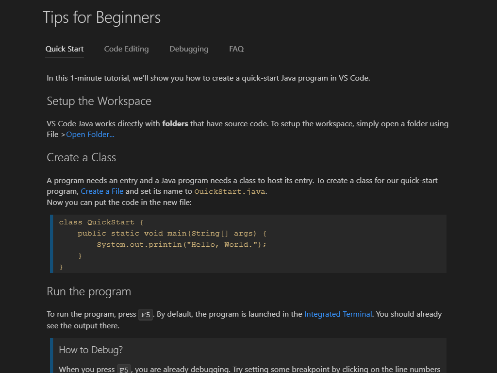

# markdown tutorial

# this is a heading

## this is a smaller heading

### this is a smaller heading

this is normal text
this is on the same line

**this is bolded text** this is unbolded

*italics*

>this is block quotes
> 
> this continues

1. ordered list
2. item 2

- unordered list
- item 2

`//for code`

the `while()` loop is cool!

```java
public class Main{
    public static void main(String[] args) {
        System.out.println("hello world");
    }
}


```
---

[github](https://desktop.github.com/)

